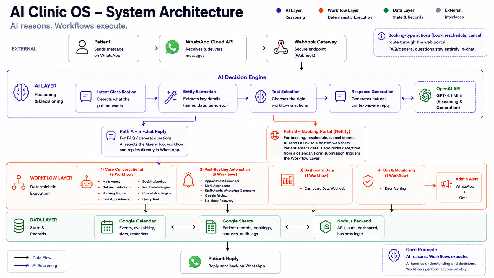

# 🏥 AI Clinic OS

> An AI-powered clinic operating system that combines conversational AI with workflow automation to streamline appointment scheduling, patient communication, and day-to-day clinic operations.

<!-- Add Hero Banner Here -->

---

## Overview

AI Clinic OS is an AI automation platform designed to reduce the operational workload inside small and medium-sized clinics.

Through a WhatsApp-based conversational interface, the system automates appointment booking, rescheduling, cancellations, reminders, and common patient enquiries.

Rather than allowing an LLM to execute every task, the architecture separates **AI reasoning** from **business execution**. The language model understands conversations and determines what needs to happen, while deterministic workflows perform scheduling, calendar synchronization, reminders, and data updates.

This approach creates a system that is reliable, predictable, cost-efficient, and practical for real-world clinic operations.

---

## Highlights

* 🤖 AI-powered WhatsApp appointment scheduling
* 📅 Google Calendar synchronization
* 🔄 Event-driven workflow orchestration with n8n
* 🧠 AI reasoning separated from deterministic execution
* 💬 Natural language patient conversations
* 🏥 Built around real clinic operations

---

# Why I Built This

While researching clinic operations, one pattern appeared repeatedly.

Receptionists spend a significant portion of their day handling repetitive WhatsApp conversations.

Typical requests include:

* Booking appointments
* Rescheduling visits
* Cancelling appointments
* Checking doctor availability
* Answering common clinic questions

Although these requests are repetitive, they still require someone to:

* Understand the request
* Check doctor availability
* Update the calendar
* Send confirmations

Most clinic management software focuses on patient records and billing, while communication remains largely manual.

AI Clinic OS explores how conversational AI can reduce this operational overhead while keeping clinic staff completely in control.

---

# Core Capabilities

| Patient Experience       | AI Layer               | Workflow Layer           | Clinic Operations      |
| ------------------------ | ---------------------- | ------------------------ | ---------------------- |
| Appointment booking      | Intent classification  | Booking workflow         | Dashboard              |
| Appointment rescheduling | Information extraction | Calendar synchronization | Appointment management |
| Appointment cancellation | Tool selection         | Reminder automation      | Patient records        |
| FAQ responses            | Context understanding  | Database updates         | Operational monitoring |
| Availability checking    | Response generation    | Business rule execution  | Multi-clinic support   |

---

# System Architecture

The platform follows one simple architectural principle:

> **AI reasons. Workflows execute.**

Instead of allowing the language model to control every operation, responsibilities are clearly separated.

| AI Layer                          | Workflow Layer         |
| --------------------------------- | ---------------------- |
| Understand patient conversations  | Book appointments      |
| Classify user intent              | Update Google Calendar |
| Extract booking information       | Update Google Sheets   |
| Generate conversational responses | Schedule reminders     |
| Select the correct workflow       | Execute business rules |

This separation improves reliability, lowers operational cost, minimizes hallucinations, and keeps business logic deterministic.

---

# Architecture Decisions

Every architectural decision was made by balancing four priorities:

* User Experience
* Reliability
* Operational Cost
* Long-Term Maintainability

Rather than selecting technologies because they were popular, each decision was driven by the operational problem the system was solving.

## Why WhatsApp?

Patients already communicate with clinics through WhatsApp.

Building around an existing communication channel removes onboarding friction and significantly improves adoption compared to requiring another application.

---

## Why Google Calendar?

Many clinics already manage doctor schedules through Google Calendar.

Instead of introducing another scheduling platform, AI Clinic OS synchronizes appointments with the calendar clinics already use, avoiding duplicate sources of truth.

---

## Why n8n?

Business logic is implemented through independent event-driven workflows.

Each workflow has a single responsibility—booking, cancellations, reminders, FAQs, or availability—which makes the system easier to debug, monitor, and extend as the product grows.

---

## Why GPT-4.1 Mini?

Appointment scheduling requires consistent reasoning more than maximum intelligence.

GPT-4.1 Mini provides an effective balance between reasoning capability, response speed, and operational cost.

The objective wasn't to use the largest model.

It was to build the most efficient system.

---

# Engineering Challenges

Building AI Clinic OS was less about integrating a language model and more about designing a reliable operational system around it.

Several engineering challenges shaped the architecture.

## Defining AI Boundaries

Early prototypes relied too heavily on the language model.

Although this reduced implementation effort, it increased API costs, made failures difficult to debug, and introduced unnecessary hallucination risk.

The architecture evolved toward limiting AI to reasoning while deterministic workflows execute business operations.

That decision became the foundation of the project.

---

## Designing Maintainable Workflows

As booking, rescheduling, cancellations, reminders, FAQs, and patient management were added, workflow complexity increased significantly.

Rather than building one large automation, every workflow was designed around a single responsibility.

This keeps the system easier to understand, test, maintain, and extend as new features are introduced.

---

## Cost Optimization

Operational cost became an engineering constraint from the beginning.

Instead of relying on increasingly larger language models, effort was invested into improving workflow design, prompt engineering, and deterministic execution.

Reducing unnecessary AI calls produced a greater impact than simply upgrading the model.

---

## Production Deployment

The platform has already been deployed and is operational within Meta's testing environment.

The remaining step before production rollout is customer onboarding and Meta Business verification, allowing clinics to communicate with real customer phone numbers through WhatsApp Business.

---

# Tech Stack

| Layer               | Technology            |
| ------------------- | --------------------- |
| Workflow Automation | n8n                   |
| AI                  | OpenAI GPT-4.1 Mini   |
| Messaging           | WhatsApp Cloud API    |
| Calendar            | Google Calendar API   |
| Backend             | Node.js               |
| Data Storage        | Google Sheets         |
| Hosting             | Railway, Netlify      |
| Frontend            | HTML, CSS, JavaScript |

---

# Lessons Learned

Building AI Clinic OS fundamentally changed how I approach AI systems.

I started the project believing the language model would perform most of the work.

Instead, I learned that reliable AI products are built by carefully defining the boundary between AI reasoning and deterministic software.

The workflow—not the language model—is the system.

The language model provides understanding and decision-making.

Everything else should remain predictable, observable, and testable.

That principle now guides how I design every AI automation system.

---

# Engineering Design

The following sections document the workflow architecture and data model behind AI Clinic OS.

## Workflow Architecture

| Workflow | Trigger | Inputs | Primary Responsibility | Outputs | Failure Handling |
|---|---|---|---|---|---|
| **Main Agent** | Inbound WhatsApp message | Raw patient message, session context | Orchestrates intent classification and routes to the correct engine | Routed workflow call + conversational reply | Returns a graceful fallback message; logs unhandled intents |
| **Booking Engine** | Router dispatch on `intent: book` | Patient name, phone, date, time, service | Creates a new appointment across Calendar and Sheets | Confirmed `bookingId`, `eventId`, confirmation message | Detects slot conflicts; returns availability alternatives |
| **Appointment Lookup Engine** | Router dispatch on `intent: lookup` | Patient phone or booking reference | Retrieves existing appointment details for the patient | Appointment record or "no booking found" response | Handles multiple matches; returns most recent by default |
| **Reschedule Engine** | Router dispatch on `intent: reschedule` | Patient phone or `bookingId`, new date and time | Cancels the existing Calendar event and creates a replacement | Updated `eventId`, updated Sheets record, confirmation message | Rolls back Calendar update if Sheets write fails |
| **Cancellation Engine** | Router dispatch on `intent: cancel` | Patient phone or `bookingId` | Marks appointment as cancelled in Calendar and Sheets | Cancelled status in Sheets, Calendar event removed, confirmation message | Confirms identity before cancellation; handles not-found gracefully |
| **FAQ Engine** | Router dispatch on `intent: faq` | Patient question, clinic context | Generates a context-aware answer to common clinic enquiries | Natural language response; no data write | Falls back to "contact the clinic" if confidence is low |
| **Reminder Engine** | Scheduled time-based trigger | Upcoming appointments from Sheets | Sends automated appointment reminders to patients via WhatsApp | Delivered WhatsApp reminder; reminder status updated in Sheets | Retries on delivery failure; logs undelivered reminders |
| **Review Engine** | Post-appointment trigger | Completed appointment record, patient phone | Requests a Google review from the patient after their visit | Review request message delivered via WhatsApp | Skips if patient previously received a review request |
| **No-show Recovery Engine** | Scheduled trigger on missed appointments | No-show flagged records from Sheets | Re-engages patients who missed their appointment with a recovery message | Re-engagement message delivered; no-show status updated | Caps re-engagement attempts; suppresses after limit is reached |

---

## Data Schema

| Field Name | Data Type | Purpose | Example Value |
|---|---|---|---|
| `booking_id` | string (UUID) | Unique identifier for the appointment, used as the primary key across all systems | `bk_8f2a1c9d` |
| `event_id` | string | Reference to the corresponding Google Calendar event, used to keep Sheets and Calendar in sync | `cal_4f9e2b1a` |
| `patient_phone` | string (E.164) | Unique patient identifier used for lookups, reminders, and conversation continuity | `+919876543210` |
| `patient_name` | string | Display name for confirmations, reminders, and staff-facing views | `Aditi Rao` |
| `service_type` | string (enum) | The clinic service booked, used for duration and resource allocation | `dental_cleaning` |
| `appointment_date` | date (ISO 8601) | Scheduled date of the appointment | `2026-07-04` |
| `appointment_time` | time (ISO 8601) | Scheduled time of the appointment | `15:30` |
| `status` | string (enum) | Current lifecycle state of the appointment | `confirmed` |
| `created_at` | timestamp (ISO 8601, UTC) | Record creation time, used for auditing and ordering | `2026-06-28T09:12:44Z` |
| `updated_at` | timestamp (ISO 8601, UTC) | Last modification time, used for sync conflict detection | `2026-06-29T11:05:02Z` |
| `reminder_sent` | boolean | Tracks whether a reminder has already been delivered, prevents duplicate sends | `true` |
| `review_requested` | boolean | Tracks whether a post-visit review request has been sent | `false` |
| `no_show_flag` | boolean | Marks an appointment as missed, used to trigger recovery workflows | `false` |
| `source_channel` | string (enum) | Origin of the booking, useful for analytics and multi-channel support | `whatsapp` |

---

# Connect

If you're interested in Applied AI, workflow automation, or building operational AI systems, I'd be happy to connect.

* 💼 **LinkedIn:** https://linkedin.com/in/dhruva-reddy-gaddam
* 💻 **GitHub:** https://github.com/GDR-26
* 🌐 **Portfolio:** *Coming Soon*
